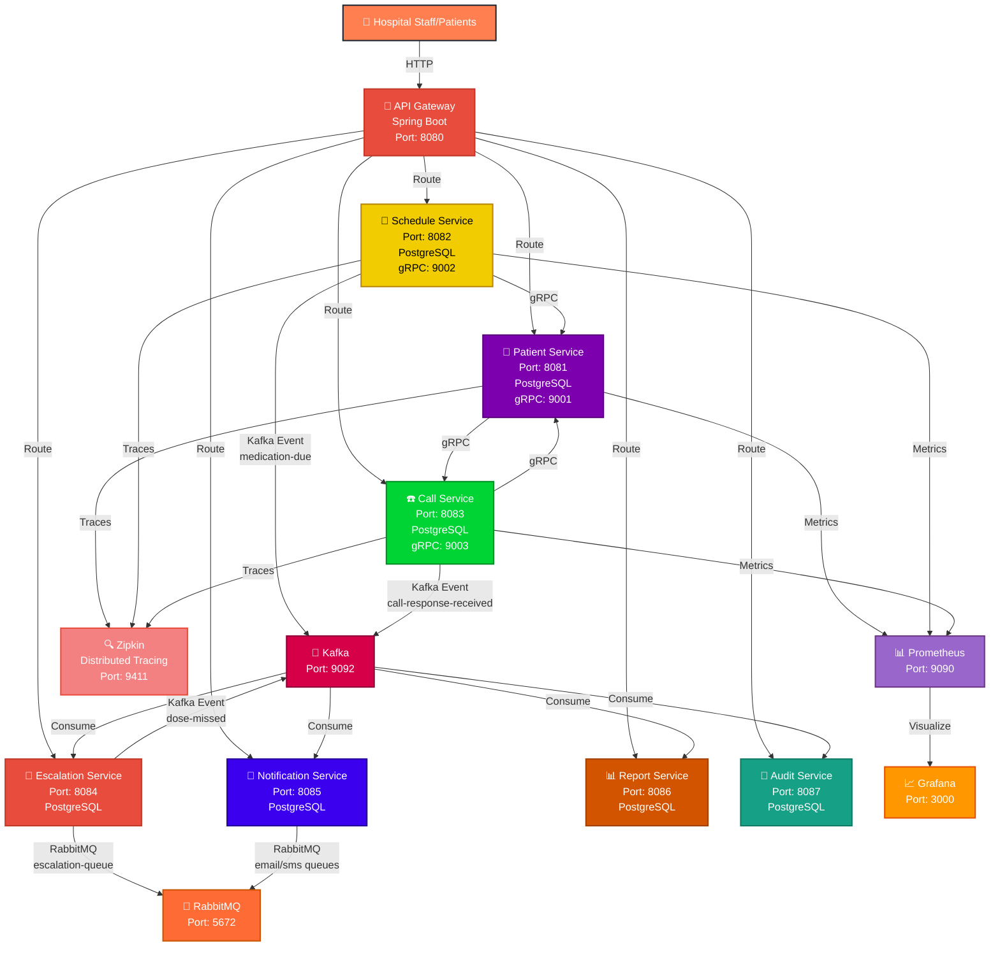
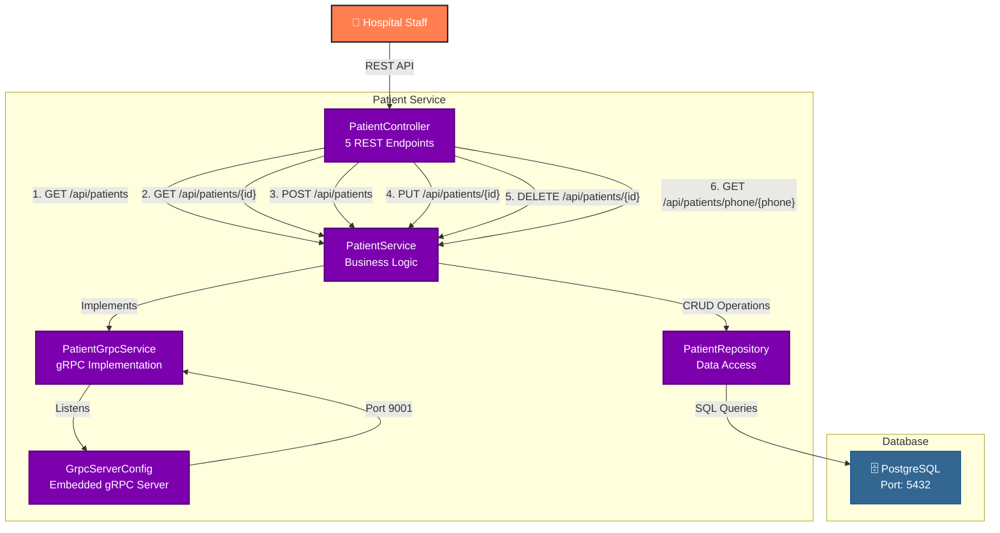
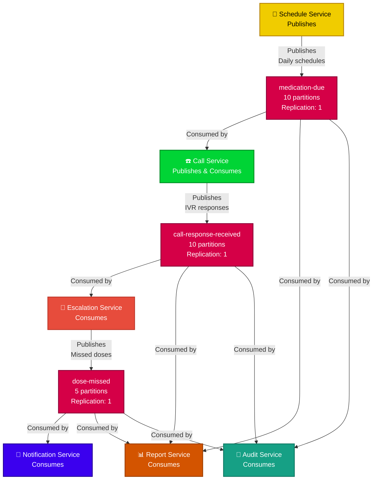

# Hospital Medication Reminder System

A distributed medication reminder platform built with Spring Boot microservices , demonstrating enterprise-grade architecture for healthcare systems handling **400K daily medication reminders** across multiple hospitals with event-driven communication and real-time compliance tracking.

---

## Table of Contents

1. [System Architecture](#system-architecture)
2. [Functional Requirements](#functional-requirements)
3. [Non-Functional Requirements](#non-functional-requirements)
4. [Technology Stack](#technology-stack)
5. [Project Structure](#project-structure)
6. [Microservices Overview](#microservices-overview)
7. [API Endpoints](#api-endpoints)
8. [Layered Architecture](#layered-architecture)
9. [Communication Patterns](#communication-patterns)
10. [Key Design Patterns](#key-design-patterns)
11. [Setup & Deployment](#setup--deployment)

---

## System Architecture

### Overall System Design



The system follows a **microservices decomposed by business capability** pattern with:
- Single API Gateway entry point
- Service-to-service communication via gRPC (synchronous) and REST (async via Kafka)
- Event-driven architecture for medication reminders and escalations
- Asynchronous notifications via Kafka → RabbitMQ → Email/SMS
- Distributed tracing and metrics collection

---

## Functional Requirements

✅ **Hospital Administration**
- Register patient information (name, phone, location)
- Create medication schedules for patients
- Set medication reminders at specific times
- View patient medication history
- Send patients for follow-up escalation

✅ **Medication Reminder System**
- Daily medication reminder calls at scheduled times
- IVR (Interactive Voice Response) system integration
- Track medication adherence status
- Record call responses and patient interactions

✅ **Escalation & Notifications**
- Automatic escalation for missed medications
- Alert caregivers via phone calls
- Send email/SMS notifications
- Track escalation history and outcomes

✅ **Reporting & Compliance**
- Daily compliance reports by hospital
- Medication adherence analytics
- Missed dose analysis
- Historical audit trail of all transactions

✅ **Patient Management**
- Retrieve patient details by ID or phone number
- Check patient availability (in-hospital vs at-home)
- Get caregiver contact information
- Track patient medication schedules

---

## Non-Functional Requirements

| Requirement | Implementation |
|-----------|----------------|
| **Scale** | 400K daily medication reminders |
| **Latency** | Sub-second medication schedule retrieval (gRPC) |
| **Throughput** | High-volume event processing via Kafka |
| **Availability** | Distributed services, fault tolerance |
| **Consistency** | Eventual consistency via Kafka; strong for critical data |
| **Scalability** | Horizontal scaling, event-based processing |
| **Resilience** | Retry logic, circuit breakers for service calls |
| **Auditability** | Complete transaction audit trail |

---

## Technology Stack

### Core Framework
- **Spring Boot 4.0.7** - Microservices foundation
- **Java 21** - Language runtime
- **Maven 3.9+** - Build management

### API & Communication
- **gRPC 1.59.0** - Service-to-service sync communication
- **Protocol Buffers 3.24.0** - gRPC service definitions
- **Spring Web** - REST endpoints
- **Kafka 3.x** - Asynchronous event streaming
- **RabbitMQ 3.x** - Message queue for notifications

### Data Access
- **Spring Data JPA** - ORM with Hibernate
- **PostgreSQL 15** - Primary transactional database
- **Liquibase** - Database schema versioning

### Service Discovery & Configuration
- **Spring Cloud Config** - Centralized configuration (optional)
- **Eureka** - Service registry (optional for Phase 2)

### Security & Authentication
- **Spring Security** - Authorization framework (Phase 2)
- **OAuth2/OIDC** - Future authentication layer

### Observability
- **Zipkin** - Distributed tracing
- **Prometheus** - Metrics collection
- **Grafana** - Metrics visualization
- **SLF4J** - Structured logging

### Development Tools
- **Lombok** - Reduce boilerplate code
- **Docker** - Containerization
- **Docker Compose** - Infrastructure orchestration

---

## Project Structure

```
med-reminder-system/
├── common/                          # Shared libraries & utilities
│   ├── src/main/java/
│   │   ├── dto/                     # DTOs for inter-service communication
│   │   │   ├── MedicationDueEvent.java
│   │   │   ├── CallResponseEvent.java
│   │   │   └── DoseMissedEvent.java
│   │   ├── util/                    # Constants & utilities
│   │   │   └── Constants.java       # Kafka topics, RabbitMQ queues, gRPC ports
│   │   ├── config/                  # Infrastructure configuration
│   │   │   ├── KafkaConfig.java
│   │   │   └── RabbitMQConfig.java
│   │   └── proto/                   # gRPC service definitions
│   │       └── services.proto       # PatientService, ScheduleService, CallService
│   └── pom.xml
│
├── api-gateway/                     # Request routing & load balancing
│   ├── src/main/java/
│   │   └── com/medreminder/gateway/
│   │       ├── GatewayApplication.java
│   │       └── config/
│   └── pom.xml
│
├── patient-service/                 # COMPLETE: Patient management
│   ├── src/main/java/
│   │   └── com/medreminder/patient/
│   │       ├── PatientServiceApplication.java
│   │       ├── entity/              # JPA entities
│   │       │   └── Patient.java
│   │       ├── repository/          # Data access layer
│   │       │   └── PatientRepository.java
│   │       ├── service/             # Business logic
│   │       │   └── PatientService.java
│   │       ├── controller/          # REST endpoints
│   │       │   └── PatientController.java
│   │       ├── grpc/                # gRPC implementation
│   │       │   └── PatientGrpcService.java
│   │       ├── config/              # Configuration
│   │       │   └── GrpcServerConfig.java
│   │       └── exception/           # Custom exceptions
│   │           └── ResourceNotFoundException.java
│   ├── src/main/resources/
│   │   └── application.yml
│   └── pom.xml
│
├── schedule-service/                # TODO: Medication schedule management
│   ├── src/main/java/
│   ├── src/main/resources/
│   └── pom.xml
│
├── call-service/                    # TODO: Call management & IVR
│   ├── src/main/java/
│   ├── src/main/resources/
│   └── pom.xml
│
├── escalation-service/              # TODO: Escalation handling
│   ├── src/main/java/
│   ├── src/main/resources/
│   └── pom.xml
│
├── notification-service/            # TODO: Email/SMS notifications
│   ├── src/main/java/
│   ├── src/main/resources/
│   └── pom.xml
│
├── report-service/                  # TODO: Analytics & reporting
│   ├── src/main/java/
│   ├── src/main/resources/
│   └── pom.xml
│
├── audit-service/                   # TODO: Transaction audit trail
│   ├── src/main/java/
│   ├── src/main/resources/
│   └── pom.xml
│
├── docker-compose.yml               # Infrastructure setup
├── pom.xml                          # Parent POM (all modules)
└── README.md                        # This file
```

---

## Microservices Overview

### 1. **API Gateway** (Port: 8080)

Entry point for all external requests. Routes requests to appropriate microservices.

**Responsibilities:**
- HTTP request routing to backend services
- Load balancing
- Request/response logging

---

### 2. **Patient Service** (Port: 8081) ✅ COMPLETE

Manages patient information and provides gRPC endpoints for other services.

**Database:** PostgreSQL

**Architecture:**



**Entities:**
- **Patient**: patientId (UUID), hospitalId, firstName, lastName, phoneNumber, location (in-hospital/at-home), createdAt

**REST Endpoints:**
- `GET /api/patients` - Fetch all patients
- `GET /api/patients/{patientId}` - Fetch specific patient
- `POST /api/patients` - Create new patient
- `PUT /api/patients/{patientId}` - Update patient
- `DELETE /api/patients/{patientId}` - Delete patient
- `GET /api/patients/phone/{phoneNumber}` - Get patient by phone

**gRPC Services:**
- `GetPatientById(patientId)` → PatientData
- `GetCaregiverPhone(patientId)` → CaregiverPhone

**Key Features:**
- Unique phone number constraint
- gRPC server on port 9001 for service-to-service calls
- Used by Schedule Service, Call Service, Escalation Service

---

### 3. **Schedule Service** (Port: 8082) TODO

Manages medication schedules and publishes medication-due events.

**Database:** PostgreSQL

**Entities needed:**
- **Schedule**: scheduleId (UUID), patientId, medicationId, hospitalId, scheduledTime, status, createdAt
- **Medication**: medicationId, name, dosage, instructions, createdAt

**Key Methods:**
- `getSchedulesForToday(patientId)` → List<Schedule>
- `createSchedule(Schedule)` → Schedule
- `updateScheduleStatus(scheduleId, status)` → void
- `publishMedicationDueEvent()` → Kafka event

**Kafka Producer:**
- Publishes `medication-due` events (10 partitions) with MedicationDueEvent data
- Triggered by scheduler at scheduled times

**gRPC Services:**
- `GetSchedulesForToday(patientId)` → SchedulesResponse

**Dependencies:**
- Calls PatientService gRPC for patient validation

---

### 4. **Call Service** (Port: 8083) TODO

Manages medication reminder calls and IVR responses.

**Database:** PostgreSQL

**Entities needed:**
- **CallLog**: callLogId (UUID), scheduleId, patientId, callStatus, ivrResponse, duration, createdAt
- **IvrInteraction**: interactionId, callLogId, prompt, userInput, result

**Key Methods:**
- `initiateCall(scheduleId)` → CallLog
- `updateCallStatus(callLogId, status, ivrResponse)` → void
- `getCallLogs(patientId)` → List<CallLog>

**Kafka Producer:**
- Publishes `call-response-received` events (10 partitions) when IVR completes

**Kafka Consumer:**
- Listens to `medication-due` events from Schedule Service
- Triggers outbound calls via IVR system

**gRPC Services:**
- `UpdateCallLog(callLogId, status, ivrResponse)` → Response

**Dependencies:**
- Calls PatientService gRPC for patient phone number
- Receives events from ScheduleService

---

### 5. **Escalation Service** (Port: 8084) TODO

Handles missed medication escalations and caregiver notifications.

**Database:** PostgreSQL

**Entities needed:**
- **Escalation**: escalationId (UUID), scheduleId, patientId, reason, escalationLevel, createdAt
- **EscalationHistory**: escalationId, action, timestamp

**Key Methods:**
- `escalateMissedDose(scheduleId, patientId)` → Escalation
- `notifyCaregiverPhone(patientId)` → void
- `publishEscalationEvent()` → RabbitMQ

**Kafka Consumer:**
- Listens to `dose-missed` events (5 partitions)
- Triggered when patient misses medication

**RabbitMQ Producer:**
- Publishes to `escalation-queue` with routing key `escalation.route`
- Sends escalation alerts to caregivers

**Dependencies:**
- Calls PatientService gRPC for caregiver phone
- Consumes events from Call Service

---

### 6. **Notification Service** (Port: 8085) TODO

Sends email and SMS notifications for escalations and reminders.

**Database:** PostgreSQL

**Entities needed:**
- **Notification**: notificationId (UUID), escalationId, type (email/sms), recipient, status, createdAt
- **NotificationTemplate**: templateId, type, subject, body

**Key Methods:**
- `sendEmail(recipient, subject, body)` → void
- `sendSms(phone, message)` → void
- `logNotification(Notification)` → void

**RabbitMQ Consumer:**
- Listens to `email-queue` (routing key: `email.route`)
- Listens to `sms-queue` (routing key: `sms.route`)
- Processes and sends notifications

**Dependencies:**
- External email service (SMTP)
- External SMS provider (Twilio, etc.)

---

### 7. **Report Service** (Port: 8086) TODO

Generates compliance reports and analytics.

**Database:** PostgreSQL (read-only aggregations)

**Entities needed:**
- **Report**: reportId (UUID), hospitalId, dateRange, totalSchedules, missedDoses, complianceRate, createdAt
- **ReportMetric**: reportId, metricName, value

**Key Methods:**
- `generateDailyReport(hospitalId, date)` → Report
- `getComplianceMetrics(hospitalId, startDate, endDate)` → List<Metric>
- `getMissedDoseAnalysis(hospitalId, startDate, endDate)` → Analysis

**Kafka Consumer:**
- Listens to all events for data aggregation
- Processes historical data for compliance calculations

**REST Endpoints:**
- `GET /api/reports` - Fetch all reports
- `GET /api/reports/daily/{hospitalId}/{date}` - Get daily compliance
- `GET /api/reports/compliance/{hospitalId}` - Get compliance metrics

---

### 8. **Audit Service** (Port: 8087) TODO

Maintains complete transaction audit trail.

**Database:** PostgreSQL

**Entities needed:**
- **AuditLog**: auditId (UUID), entityType, entityId, action, userId, timestamp, changeDetails

**Key Methods:**
- `logAuditEvent(entityType, entityId, action, details)` → void
- `getAuditTrail(entityId)` → List<AuditLog>
- `getAuditsByDateRange(startDate, endDate)` → List<AuditLog>

**Kafka Consumer:**
- Listens to all Kafka topics
- Subscribes to `medication-due`, `call-response-received`, `dose-missed` events
- Logs every transaction for compliance & investigation

**REST Endpoints:**
- `GET /api/audit/{entityId}` - Get audit trail for entity
- `GET /api/audit/date-range` - Query audits by date range

---

## API Endpoints

### Summary

| Service | Count | Type | Status |
|---------|-------|------|--------|
| API Gateway | 1 | Route | Complete |
| Patient Service | 6 | REST + gRPC | ✅ Complete |
| Schedule Service | 3 | REST + gRPC | TODO |
| Call Service | 3 | REST + gRPC | TODO |
| Escalation Service | 2 | REST + RabbitMQ | TODO |
| Notification Service | 2 | REST + RabbitMQ | TODO |
| Report Service | 3 | REST | TODO |
| Audit Service | 2 | REST | TODO |
| **Total** | **22** | | |

---

## Layered Architecture

Each microservice follows a **clean layered architecture**:

### Data Layer
- **Entities**: JPA annotated POJO classes
- **Repositories**: JPA repositories with custom query methods
- Domain model first approach

### Business Layer

#### Service Interfaces
- Define service contracts
- Enable future implementations
- Support SOLID principles

#### Service Implementations
- Business rule validation
- gRPC/REST client orchestration
- Event publishing
- DTO transformation via Lombok

#### Business Rules & Validation
- Custom exception throwing
- Input validation before persistence
- Error handling with meaningful messages

### API Layer

#### Controllers
- REST endpoint definitions
- Request/response handling
- Service dependency injection

#### gRPC Services
- Implement generated service interfaces
- Handle streaming observers
- Error propagation via Status

---

## Communication Patterns

### Synchronous Communication (gRPC)

**gRPC Service Calls:**

Used for critical operations requiring immediate response:

- **Schedule Service → Patient Service** (gRPC)
    - Validate patient exists before creating schedule
    - Get patient location for scheduling

- **Call Service → Patient Service** (gRPC)
    - Fetch patient phone number for outbound call
    - Verify patient availability

- **Escalation Service → Patient Service** (gRPC)
    - Get caregiver contact information
    - Verify patient status

**Why gRPC?**
- Low latency (binary serialization)
- Strongly typed contracts
- Built-in service definitions (protobuf)
- Connection multiplexing

### Asynchronous Communication (Kafka)

**Event-Driven Architecture:**



**Event Flows:**

1. **Medication Due Event**
    - Source: Schedule Service (daily at medication times)
    - Consumers: Call Service (initiate calls), Report Service, Audit Service
    - Payload: scheduleId, patientId, medicationId, scheduledTime, location

2. **Call Response Event**
    - Source: Call Service (after IVR completion)
    - Consumers: Escalation Service, Report Service, Audit Service
    - Payload: scheduleId, callLogId, callStatus, ivrResponse

3. **Dose Missed Event**
    - Source: Escalation Service (when dose not taken after retries)
    - Consumers: Notification Service, Report Service, Audit Service
    - Payload: scheduleId, patientId, medicationId, reason

### Asynchronous Messaging (RabbitMQ)

**Message Queue Pattern:**

Used for notification delivery with guaranteed processing:

```
Escalation Service → RabbitMQ (escalation-queue) → Notification Service
                                ↓
                         med-reminder-exchange
                                ↓
                    ┌──────────────┬──────────────┐
                    ↓              ↓              ↓
            escalation.route   email.route   sms.route
                    ↓              ↓              ↓
          escalation-queue   email-queue   sms-queue
                    ↓              ↓              ↓
         Caregiver Alerts  Email Notifications SMS Notifications
```

---

## Key Design Patterns

### Architectural Patterns
- **Microservices** - Decomposed by business capability
- **API Gateway** - Single entry point
- **Event Sourcing (partial)** - Audit trail via events
- **Database Per Service** - Data isolation
- **gRPC for Sync** - Service-to-service calls
- **Kafka for Async** - Event-driven updates
- **RabbitMQ for Notifications** - Guaranteed delivery

### Resilience Patterns
- **Retry Logic** - Transient failure handling (future)
- **Circuit Breaker** - Prevent cascading failures (future)
- **Timeout Handling** - gRPC deadline management

### SOLID Principles
- **Single Responsibility**: Each service handles one domain
- **Open/Closed**: Extensible via new event consumers
- **Liskov Substitution**: Service interfaces enable swapping
- **Interface Segregation**: Separate gRPC/REST contracts
- **Dependency Inversion**: Depend on abstractions (services)

### Data Patterns
- **Repository Pattern** - Abstract data access
- **DTO Pattern** - Request/Response objects
- **Event-Driven Updates** - Eventual consistency via Kafka
- **Audit Trail** - Complete transaction history

---

## Setup & Deployment

### Prerequisites
- Java 21+
- Maven 3.9+
- Docker & Docker Compose
- PostgreSQL 15+
- Kafka 3.x
- RabbitMQ 3.x

### Quick Start

1. **Start Infrastructure**
   ```bash
   docker-compose up -d
   ```

   This starts:
    - PostgreSQL (Port: 5432)
    - Kafka (Port: 9092)
    - RabbitMQ (Port: 5672, UI: 15672)
    - Zipkin (Port: 9411)
    - Prometheus (Port: 9090)
    - Grafana (Port: 3000)

2. **Build All Services**
   ```bash
   mvn clean install -DskipTests
   ```

3. **Start Services (in order)**
   ```bash
   # Terminal 1: API Gateway
   cd api-gateway && mvn spring-boot:run
   
   # Terminal 2: Patient Service (+ gRPC)
   cd patient-service && mvn spring-boot:run
   
   # Terminal 3: Schedule Service
   cd schedule-service && mvn spring-boot:run
   
   # Terminal 4: Call Service
   cd call-service && mvn spring-boot:run
   
   # Terminal 5: Escalation Service
   cd escalation-service && mvn spring-boot:run
   
   # Terminal 6: Notification Service
   cd notification-service && mvn spring-boot:run
   
   # Terminal 7: Report Service
   cd report-service && mvn spring-boot:run
   
   # Terminal 8: Audit Service
   cd audit-service && mvn spring-boot:run
   ```

### Accessing Services

- **API Gateway**: `http://localhost:8080`
- **Patient Service**: `http://localhost:8081`
- **Schedule Service**: `http://localhost:8082`
- **Call Service**: `http://localhost:8083`
- **Zipkin**: `http://localhost:9411`
- **Prometheus**: `http://localhost:9090`
- **Grafana**: `http://localhost:3000`
- **RabbitMQ UI**: `http://localhost:15672` (guest/guest)
- **Kafka Topics**: Use Kafka CLI or UI

### Database Setup

```bash
# Create database (if not auto-created)
createdb -U postgres med_reminder

# Liquibase will auto-migrate schema on service startup
```

---

## Project Status

### ✅ Phase 1: Core Services (In Progress)

- [x] **Common Module** - DTOs, Kafka/RabbitMQ configs, gRPC definitions
- [x] **API Gateway** - Request routing
- [x] **Patient Service** - Complete (REST + gRPC)
    - Entities, Repository, Service, Controller, gRPC Implementation, Exception Handling
    - REST: GET, POST, PUT, DELETE, GET by phone
    - gRPC: GetPatientById, GetCaregiverPhone
    - Embedded gRPC server on port 9001
- [ ] **Schedule Service** - Medication scheduling
- [ ] **Call Service** - IVR call management
- [ ] **Escalation Service** - Escalation handling
- [ ] **Notification Service** - Email/SMS delivery
- [ ] **Report Service** - Analytics & compliance
- [ ] **Audit Service** - Transaction audit trail

### 📋 Phase 2: Advanced Features (Future)

- Service discovery (Eureka)
- Config server (Spring Cloud Config)
- Circuit breaker pattern
- API rate limiting
- Advanced authentication (OAuth2)
- Batch processing
- Performance optimization

---

## Key Features & Highlights

✅ **Healthcare-Grade Architecture**
- HIPAA-compliant audit trail
- Microservices with clear domain boundaries
- Scalable to 400K daily reminders

✅ **Event-Driven Design**
- Kafka for high-volume event processing
- RabbitMQ for guaranteed notification delivery
- Eventual consistency with audit trail

✅ **gRPC Service Communication**
- Low-latency inter-service calls
- Strongly typed contracts
- Binary serialization efficiency

✅ **Clean Code**
- Layered architecture per service
- SOLID principles throughout
- Clear separation of concerns

✅ **Observability**
- Distributed tracing (Zipkin)
- Metrics collection (Prometheus)
- Visualization (Grafana)
- Structured logging (SLF4J)

✅ **Data Integrity**
- Complete audit trail via Kafka
- Transaction tracking
- Compliance reporting

---

## Kafka Topics Configuration

```yaml
Topics:
  - medication-due
    Partitions: 10
    Replication: 1
    Retention: 7 days
    
  - call-response-received
    Partitions: 10
    Replication: 1
    Retention: 7 days
    
  - dose-missed
    Partitions: 5
    Replication: 1
    Retention: 14 days
```

---

## RabbitMQ Configuration

```yaml
Exchange: med-reminder-exchange (durable)

Queues:
  - escalation-queue → escalation.route
  - email-queue → email.route
  - sms-queue → sms.route
```

---

## gRPC Service Definitions

```protobuf
service PatientService {
  rpc GetPatientById(GetPatientByIdRequest) returns (GetPatientByIdResponse);
  rpc GetCaregiverPhone(GetCaregiverPhoneRequest) returns (GetCaregiverPhoneResponse);
}

service ScheduleService {
  rpc GetSchedulesForToday(GetSchedulesRequest) returns (SchedulesResponse);
}

service CallService {
  rpc UpdateCallLog(UpdateCallLogRequest) returns (UpdateCallLogResponse);
}
```

---

## Performance Targets

| Metric | Target |
|--------|--------|
| Daily Reminders | 400,000 |
| Avg Response Time (gRPC) | < 100ms |
| Kafka Event Processing | < 500ms |
| Medication Schedule Retrieval | < 50ms |
| Call Initiation | < 200ms |
| Notification Delivery | < 2s |

---

## Future Enhancements

- [ ] Machine learning for medication adherence prediction
- [ ] Real-time dashboard for hospital staff
- [ ] Patient mobile app integration
- [ ] Advanced IVR system (voice recognition)
- [ ] Multi-language support
- [ ] Integration with pharmacy systems
- [ ] Predictive analytics for non-compliance
- [ ] Advanced compliance metrics

---

## Contributing

This project demonstrates enterprise-grade microservices architecture for healthcare systems with emphasis on:
- Clean code and SOLID principles
- Distributed systems design
- Event-driven architecture
- Healthcare compliance and audit trails
- High-scale medication reminder processing

---

## License

This project is part of a healthcare system architecture showcase.

---
